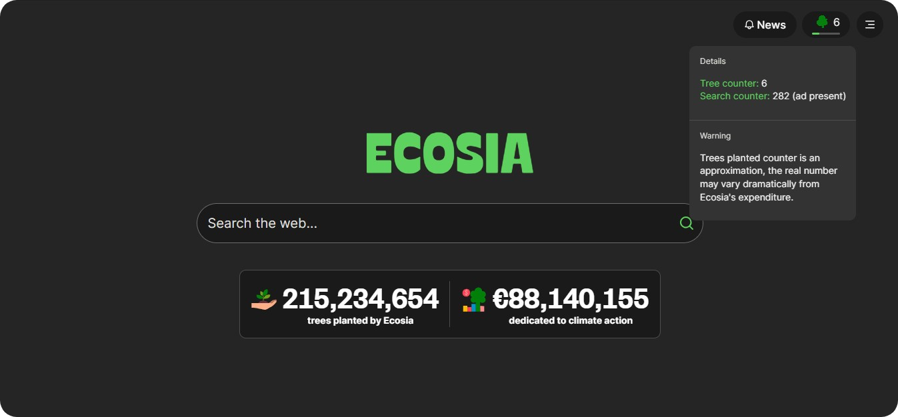

  

# Tally - Ecosia Tree Counter 🌳

## 🌠 About
Tally is a simple extension to bring back the Ecosia Tree Counter. We try the best to make the tree counter seems like made by Ecosia team.

## ❓ Why
Since september of 2023, Ecosia is no longer supporting their Tree Counter. Their explanation can be found [here](https://ecosia.helpscoutdocs.com/article/505-new-search-providers).

A lot of users didn't like the way things came to end (including me). That's why this extension exists.

## 🗄️ Source
Tally is a fork from sq-lr's "Ecosia Tree Counter" extension, wich can be finded [here](https://chromewebstore.google.com/detail/ecosia-tree-counter/ibhggeicdlhjfodagonccghdijkcdcbg).

Source code is also avaliable [here](https://github.com/sq-lr/ecosia-tree-counter).
